<picture>
  <source media="(prefers-color-scheme: dark)" srcset="docs/images/icon-dark.png">
  
</picture>

# Codometer

Codometer keeps an eye on your **Claude Code** and **Codex** limits and on the agents working for you, and puts
them one glance away — on a screen edge, in a floating card, in the menu bar, or on your desktop as a widget.

It is a native macOS app. Everything it shows is read from files the two CLIs already write on your Mac. Nothing is
uploaded, no account is switched for you, and no limit is worked around.

[Русская версия](README.ru.md) · [Privacy](PRIVACY.md) · [Security](SECURITY.md) · [Changelog](CHANGELOG.md)

---

## What you get


**The island** is a small capsule at any edge of the screen with one ring per limit. Reach for it and it expands
into a card: the main window as a big figure with its chart, tiles for the other windows, and the agent sessions
that are running. A ring's colour tracks usage only; purple is reserved for “an agent is waiting for you”.

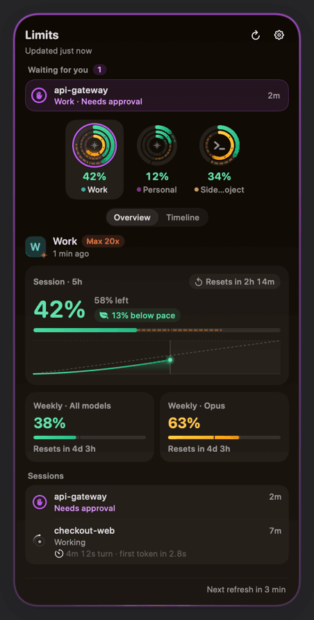

**The floating card** is the other way to show the same thing: a small window you can drop anywhere, in four
themes and three sizes, which shrinks to a pill when you are busy. Exactly one of the two is on screen at a time.

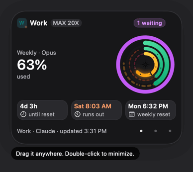

**The menu bar** always stays, whichever style you chose: a live ring icon with your highest usage. Click it for
the same card in a popover, right-click it for the menu.

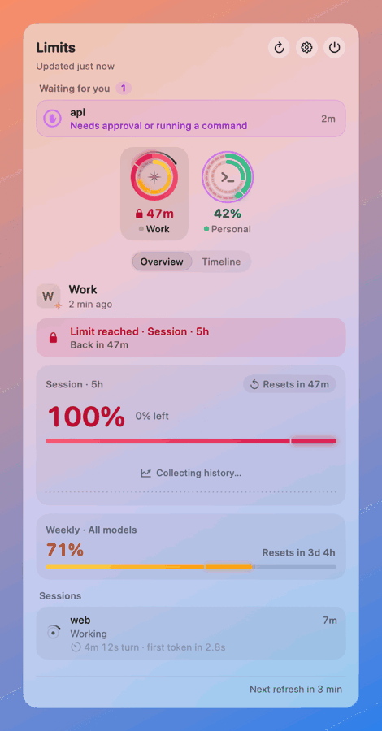

**Desktop widgets** — “AI Limits” for every account in three sizes, plus “Claude” and “Codex” for one service each
in two sizes: usage rings, the window that resets next, and the countdown to it.

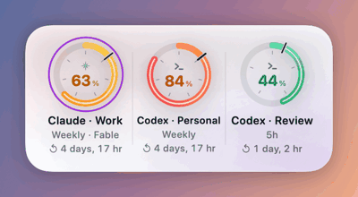

**Analytics** live on the card's second page: session bars under the usage curve of the main window, reset marks,
and “Who used the limit” — the share of the window each project took over the last 5 hours, 24 hours or 7 days.

**Notifications** cover thresholds (80 %, 100 % and any you add), limit resets, “agent finished” with its turn
time, and “agent is waiting for you”. A new event replaces the old notification for the same session or window
instead of stacking on top of it, and several events that arrive together become one.

Codometer also watches more than one account. Claude Code and Codex keep one sign-in per profile folder, so each
account is a folder (`CLAUDE_CONFIG_DIR` / `CODEX_HOME`) — see [Add a second account](#add-a-second-account).

---

## Requirements

- **macOS 26 (Tahoe) or later.** Codometer is built against the macOS 26 SDK and uses nothing older.
- **Apple silicon.** The 1.0.0 build is arm64 only.
- **Claude Code and/or Codex**, installed and signed in. Codometer reads what they write under `~/.claude*` and
  `~/.codex*` and runs their own commands (`claude /usage`, `codex app-server`) to refresh limits. Without either
  one there is nothing to show.
- To build from source: **Xcode 26** (see [Build from source](#build-from-source)).

---

## Install

Codometer is not on the Mac App Store. Every release is a DMG attached to a GitHub release.

1. **Download** `Codometer-1.0.0.dmg` from the [Releases page](https://github.com/iexbase/Codometer/releases/latest) of this repository.
2. **Check it (optional).** `SHA256SUMS.txt` comes with the same release:

   ```bash
   cd ~/Downloads && shasum -a 256 -c SHA256SUMS.txt --ignore-missing
   ```

3. **Open the DMG and drag Codometer to Applications.** Always move it there before the first launch. Started from
   the disk image, from Downloads or from any read-only volume, Codometer shows a “Move Codometer to Applications”
   alert and quits without writing anything: widgets, notifications and “Open at login” only work from an installed
   copy.
4. **Open it** from Applications — and expect Gatekeeper to stop you the first time, because this build is not
   signed with a Developer ID yet.

### Getting past Gatekeeper on an unsigned build

1.0.0 is an **ad-hoc signed** build: it carries no Developer ID and is not notarized, so macOS cannot tell you who
made it. Anything you download in a browser is quarantined, and the first launch shows the warning *Apple could not
verify “Codometer” is free of malware* with **Done** and **Move to Trash** — and no Open button. Control-clicking
the app no longer offers one either; that bypass is gone since macOS 15.

The honest route, once per version:

1. Double-click Codometer in Applications and press **Done** on the warning.
2. Open **System Settings → Privacy & Security** and scroll to Security. Right after the attempt there is a line
   saying *“Codometer” was blocked to protect your Mac*, with an **Open Anyway** button.
3. Press **Open Anyway**, authenticate, then press **Open** in the dialog that follows.

If you prefer Terminal, this does the same thing in one step by removing the quarantine flag:

```bash
xattr -dr com.apple.quarantine /Applications/Codometer.app
```

Either way you are vouching for the download yourself, so check the checksum first. A DMG fetched with `curl` is
never quarantined and will not prompt at all — which is convenient and is exactly why the checksum matters.

You go through this again after every ad-hoc update: the code hash changes, so macOS asks again.

**Once a Developer ID is added,** none of this applies. A signed and notarized build shows the ordinary *“Codometer
is an app downloaded from the Internet. Are you sure you want to open it?”* once, you press **Open**, and that is
it — including offline, because the notarization ticket is stapled to the app. The DMG keeps the same name; the
signing mode is recorded in the release notes and in the release's `build-info.json`.

### Updating

Quit Codometer from the menu bar, replace `/Applications/Codometer.app` with the new copy, and open it again. Your
settings, history and widget placements stay where they are. There is no auto-update and no update check: nothing
in Codometer phones home.

---

## First run

The first launch opens a short welcome guide — six steps, no probing of anything until you finish or skip it.

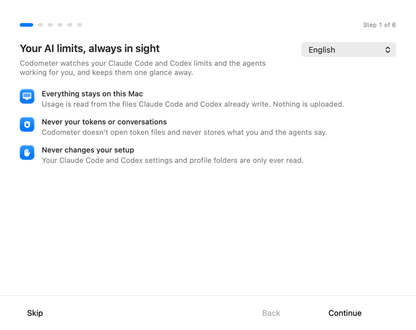

1. **Welcome** — what Codometer does, and the three promises it keeps: everything stays on this Mac, your tokens
   and conversations are never read, your Claude Code and Codex setup is never changed.
2. **Found on this Mac** — every `~/.claude*` and `~/.codex*` profile it found, with a switch each. Turn on the
   ones you want watched.
3. **Where your limits live** — island or floating card, which edge, and whether the island blends into the camera
   notch.
4. **A second account?** — optional, and covered below.
5. **Notifications and startup** — the notification permission is asked for here, with context, and “Open at login”
   is one toggle.
6. **You're all set.**

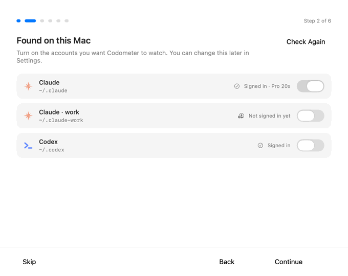

You can open the same guide again later: **Settings → General → Show Welcome Guide…**.

### Add a second account

Claude Code and Codex keep one sign-in per profile folder, so a second account needs a folder of its own. The
wizard in step 4 walks you through it, and Settings → Accounts has the same guide. By hand:

```bash
# Claude: start Claude Code in a new profile folder, then run /login inside it
CLAUDE_CONFIG_DIR=~/.claude-work claude
```

```bash
# Codex: create the folder and sign in
mkdir -p ~/.codex-work && CODEX_HOME=~/.codex-work codex login
```

Start that account's CLI with the same variable every time you work in it. The new profile then shows up under
**Settings → Accounts → Found on this Mac**; switch it on and give it a name.

Codometer never runs those commands for you and never writes into a profile folder.

---

## Living with it

**The island.** Drag it to any edge; it snaps, and holding ⌘ while dragging places it exactly. Hover, click, or
both can expand it (Settings → Presentation → Interaction). A pinned island closes on a click elsewhere, on a click
on the empty part of its header — or on **Esc, even while another app is in front**: while the island is pinned and
Codometer is not the active app, a scoped Esc hot key is armed, and it is the only key that reaches Codometer.
An island opened by hover never arms it, so an Esc meant for the app you are typing in is never swallowed.

Right-click the island for its menu, double-click it for Settings. On a MacBook it can wrap around the camera
notch and turn solid black, so it reads as part of it.


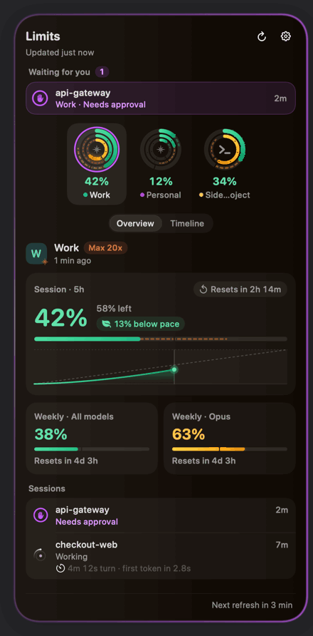

**The keyboard shortcut.** ⌃⌥⌘U by default (⌃⌥Space, ⌃⌥⌘L or off are the alternatives) expands and collapses the
active surface from any app, and opens straight to the agents waiting for you when there are any. It is registered
with the Carbon hot key API, so it needs no Accessibility permission and sees no other key you press. If macOS or
another app already owns the combination, Settings → General says so and offers alternatives.

**The floating card.** Drag it anywhere and double-click it to shrink it to a pill; one click on the pill brings
the card back. Right-click it for themes (Graphite, Liquid Glass, Midnight, Light), sizes (Compact, Regular, Strip),
which account it follows, whether it stays above other windows, and which display it lives on. **Strip** (also a
choice of its own in Settings → Presentation → “Show usage as”) is a wide, short bar: what’s left of the week that binds on the left, one chip per limit window on the right, each with its usage
and its reset. Its **Show** menu picks the scope — this account, every Claude account, every Codex account, or all of
them — and windows of the same kind on several accounts fold into one chip that shows the fullest and counts the
accounts behind it. Click the card once and it
takes the keyboard: ← and → switch accounts, Esc minimizes, ⌘, opens Settings — and until you click it, Esc belongs
to whatever you were doing.

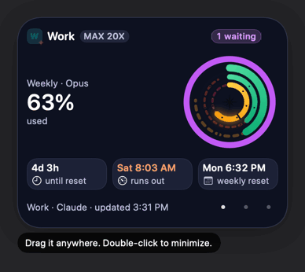
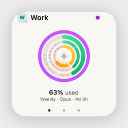


**Widgets.** Control-click an empty spot on the desktop → **Edit Widgets…** → find **Codometer** → drag the size
you like. “AI Limits” covers every account; “Claude” and “Codex” show the busiest account of one service.
“AI Limits · Strip”, “Claude · Strip” and “Codex · Strip” are the same three as the wide strip, whatever the setting
below says.

Settings → General → **Widget layout** picks how the medium and large sizes look: **Rings** (a ring per account with
the number inside) or **Strip** — the weekly window as one big figure of what is *left*, and a compact tile for every
other window with its usage and reset countdown. Tiles shared by several accounts carry a small ⊞ count; what does not
fit becomes “+N”. The small size keeps its ring either way, and the widget switches within a minute.

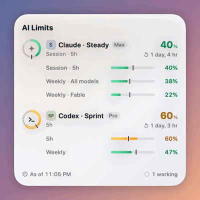

WidgetKit only allows a few dozen reloads a day, so Codometer publishes sparingly: identical content is skipped,
important changes (a ring changing colour, a limit reached or going stale, an agent waiting, the set of accounts)
at most once a minute, everything else at most once every 15 minutes, never more than 12 times an hour. **A widget
lagging a few minutes behind the island is normal.** If Codometer is not running, the widget greys its readings out
30 minutes after the last one.

---

## Settings

Six panes. The island or card you see in Settings is the real thing with your real data, and the backdrop switches
so you can check that the glass stays readable.

| Pane | What is in it |
|---|---|
| **Accounts** | The accounts being tracked, the profiles found on this Mac, groups (up to 8, e.g. Work and Personal, each with its own notification switches), and the second-account guide. |
| **Presentation** | Island or floating card; the island's edge, what expands it, its shape (attached or floating), surface (Liquid Glass, dark glass, black) and size; the card's theme, size, account and third tile; which display each one uses; snapping and haptic feedback; blending with the camera notch. |
| **Appearance** | Glass tinted by usage; how much the island shows when it opens — the essentials (every limit with what’s used, what’s left and the reset; the default) or everything (chart, pace, sessions, timeline); what the island shows (reset time as a countdown or a clock, weekly limits as inner rings, pace and run-out forecast, the forecast arc, celebrating a reset); where the ring colours change (yellow at, red at); whether email addresses are shown, masked or hidden everywhere. |
| **Notifications** | The thresholds to notify at; the events (limit reset, agent finished, agent waiting for you); skipping short turns; clearing an alert once the agent continues; grouping alerts that arrive together; sounds and whether the island peeks by itself. |
| **General** | Language, startup, the keyboard shortcut, the widget, energy, network, history and data, where limits come from, privacy, the welcome guide and About. |
| **Diagnostics** | The system check, how each account's refreshes are going, the provider tools and their signatures, the data format, storage, and locally kept crash reports. |

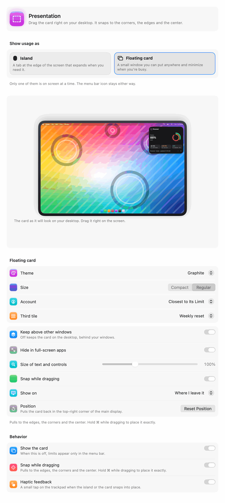
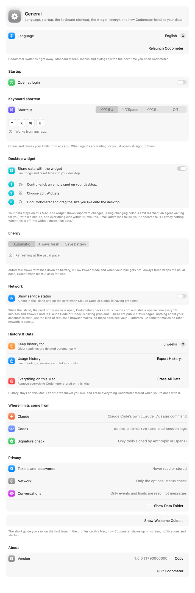

Inside **General**:

- **Language** — English, Русский or System Language. Codometer's own text switches at once; standard macOS menus
  and dialogs follow the next time you open it, and there is a “Relaunch Codometer” button next to the note.
- **Startup** — Open at login, with the approval state macOS reports.
- **Keyboard shortcut** — the four choices above, with a warning when the combination is taken.
- **Desktop widget** — share data with the widget, or turn it off (which deletes the snapshot file); Widget layout: Rings or Strip.
- **Energy** — Automatic, Always fresh or Save battery. Automatic slows refreshes down on battery, in Low Power
  Mode and when the Mac runs hot; a line under the picker always says what is happening right now.
- **Network** — “Show service status”, **off by default**. See [Privacy](#privacy) below.
- **History & Data** — how long history is kept (1 week, 2 weeks, 5 weeks or 3 months; 5 weeks by default),
  Export History…, and Erase All Data….
- **Where limits come from** and **Privacy** — short, honest statements that match this README, plus the button
  that reveals the data folder in Finder.
- **Welcome guide** — opens the first-run guide again.
- **About** — version and build number, and the license line.

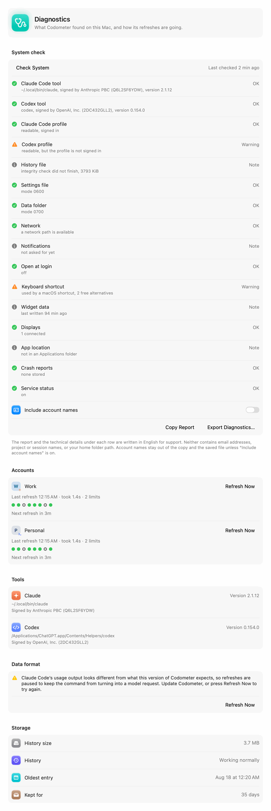

---

## Privacy

The short version, with the details in [PRIVACY.md](PRIVACY.md):

- **Tokens, passwords, cookies and Keychain items are never read.** Anthropic and OpenAI talk to their own servers
  through their own CLIs; Codometer only looks at what those CLIs leave on disk. `auth.json` is checked by its
  timestamp, never opened.
- **Conversations are never read or stored.** From Claude transcripts Codometer decodes only `requestId`,
  `message.id`, the model name, the four `usage` counters and the timestamp. From Codex rollout logs it decodes
  only event types and numbers. Prompts, replies, tool input and output are skipped without being decoded.
- **There is no network access at all** unless you turn on **Settings → General → Network → Show service status**,
  which is **off by default**. With it on, and only while the island, the card or the popover is visible, Codometer
  asks `status.claude.com` and `status.openai.com` — two public status pages — every 10 minutes. Nothing about your
  accounts is sent; those sites see the request and your IP address, like any browser visit. There is no telemetry,
  no crash upload and no update check.
- **Only signed vendor tools are run**, and only in a fixed empty working folder with a clean environment: `claude`
  signed by Anthropic PBC (team `Q6L2SF6YDW`) and `codex` signed by OpenAI (team `2DC432GLL2`). A look-alike
  dropped into `~/.local/bin` is not executed.
- **Codometer never writes into your Claude Code or Codex folders** and never changes their configuration.
- Email addresses are shown, masked (`j•••••e@example.com`) or hidden everywhere per one setting, and are never
  exported, never written into the diagnostics report and never sent to a widget when hidden.

### Where your data lives

Everything Codometer keeps is in one folder, `~/Library/Application Support/Codometer` (`0700`, files `0600`):

| Item | What it holds |
|---|---|
| `settings.json` | Accounts (names and profile paths), groups and every preference |
| `history.sqlite` (+ `-wal`, `-shm`) | Limit readings, session segments, token counts in 5-minute buckets, collection runs |
| `Widget/snapshot.json` | Exactly what the widget draws — names, windows, counts |
| `Diagnostics/` | MetricKit crash and hang payloads, kept locally, never sent |
| `probe/` | A fixed, empty working folder for the CLI commands |
| `.lock` | The single-instance lock |

macOS keeps two more things of its own: `~/Library/Containers/com.codometer.Codometer.Widgets/` (the widget
extension's sandbox) and the app's preferences domain, which holds the interface language and the Settings window
frame.

**Export.** Settings → General → History & Data → **Export History…** writes one JSON file or a folder of CSVs
(`limits.csv`, `sessions.csv`, `tokens.csv`, `collection-runs.csv` plus a `README.txt` that explains them). Times
are ISO 8601, numbers use a dot, column names are English. Email addresses, session titles and prompts are never in
an export.

**Erase.** Settings → General → History & Data → **Erase All Data…** is a two-step sheet that says exactly what
goes and what stays, and offers to export first. It deletes the history and the timeline, settings, accounts and
groups, the widget data, the delivered notifications and the login item — and leaves your Claude Code and Codex
profiles, anything you already exported, and Codometer itself alone. Then it either quits or starts over as a fresh
install, your choice. It cannot be undone.

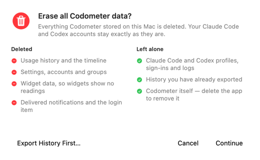

---

## Uninstall

1. **Settings → General → Startup**: turn **Open at login** off (or System Settings → General → Login Items &
   Extensions).
2. Remove the widgets: Control-click the desktop → **Edit Widgets…**, then remove the Codometer ones.
3. Optional but tidy: **Settings → General → History & Data → Erase All Data…**, and choose *Erase and Quit*.
4. Quit Codometer from the menu bar item and move `/Applications/Codometer.app` to the Trash.
5. Leftovers, if you skipped step 3 or want the last traces gone:

   ```bash
   rm -rf ~/Library/Application\ Support/Codometer
   rm -rf ~/Library/Containers/com.codometer.Codometer.Widgets
   defaults delete com.codometer.Codometer
   ```

6. Claude Code creates an empty folder for the working directory Codometer hands its commands. It is safe to delete
   the `…-Codometer-probe` folder under
   `~/.claude*/projects/`.
7. If you used the app under its former name, remove its login item in System Settings → General → Login Items &
   Extensions, and its widgets from the desktop, too.

---

## Troubleshooting

**The widget is empty, or stuck on a placeholder.**
Open Codometer at least once from `/Applications` — the first launch is what registers the widget extension with
macOS. Check that Settings → General → **Share data with the widget** is on. Then:

```bash
# is the extension registered, and which copy?
pluginkit -m -v -i com.codometer.Codometer.Widgets

# what the widget itself reports: one line per request, counters only
log stream --predicate 'subsystem == "com.codometer.widgets"' --level info
```

The log line says whether the snapshot was `loaded`, `missing`, `denied` or `invalid`, how many accounts it had and
how old it was — no names, addresses or percentages. If several copies of Codometer exist (an old build folder, a
mounted DMG, a copy in Downloads), they compete for the same widget identifier; keep one in `/Applications`, delete
the rest, and log out and back in if the gallery still looks stale.

**Nothing updates, or an account never refreshes.**
Open **Settings → Diagnostics**: each account shows its last refresh, how long it took, how many limits came back,
and why a refresh was skipped (offline, waiting for sign-in, logs already fresh, paused after a format change).
**Check System** looks at the tools, the profiles, the files and the permissions and reports each one; **Copy
Report** gives you a sanitized English text for a bug report — no email addresses, no project or session names, no
home folder path.

**“Data format” says refreshes are paused.**
Claude Code's usage output changed shape. Codometer stops polling on purpose so `claude /usage` never turns into a
model request; press **Refresh Now** to try again, or update Codometer.

**The keyboard shortcut does nothing.**
Settings → General names the conflict and offers another combination. ⌃⌥Space is often taken by the macOS input
source switcher.

**The island is nowhere to be seen.**
Settings → Presentation → Behavior → **Show the island**, and check the display picker next to it. With the island
hidden, the menu bar icon still shows everything.

**Codometer quit with “Move Codometer to Applications”.**
It was started from a disk image, a translocated copy or a read-only volume. Drag it to Applications and open it
from there. Nothing was saved.

**Anything else.** The app logs to the unified log with no personal data in it:

```bash
log stream --predicate 'subsystem == "com.codometer.app"' --level info
log show  --predicate 'subsystem == "com.codometer.app"' --last 1h
```

Categories are `engine`, `claude`, `codex`, `storage` and `interface`.

---

## Build from source

```bash
Scripts/test.sh                  # the whole test suite
Scripts/build-app.sh debug       # assembles build/Codometer.app
Scripts/build-app.sh release     # release configuration, ad-hoc signed
Scripts/dev-register.sh build/Codometer.app   # make that copy the one macOS knows (widgets)
```

The scripts pick the toolchain themselves (`DEVELOPER_DIR=/Applications/Xcode.app/Contents/Developer`), so no
global Xcode selection is needed. There are no third-party dependencies: `Package.swift` builds eleven modules in
Swift 6 language mode with warnings as errors.

`Scripts/release.sh` runs the whole release gate — lints, tests, both release products, the bundle, signing,
notarization when credentials exist, the DMG and its verification — and writes everything to `dist/<version>/`.

More for contributors:

- [docs/DEVELOPMENT.md](docs/DEVELOPMENT.md) — the day-to-day loop, debug scenarios, snapshot renders, isolated
  data roots, and the registration rules.
- [docs/ARCHITECTURE.md](docs/ARCHITECTURE.md) — modules, data flow, polling schedule, storage, widget.
- [docs/LOCALIZATION.md](docs/LOCALIZATION.md) — how English and Russian text is written and checked.
- [docs/RELEASING.md](docs/RELEASING.md) — versions, CI, signing, notarization, the draft release.

---

## FAQ

**Does Codometer make me hit limits later?** No. It reads what the CLIs already record and calls `claude /usage`,
the command Claude Code itself provides for this. It does not switch accounts, retry requests or work around
anything.

**Does `claude /usage` cost tokens?** It is Claude Code's own usage command, not a model request. If its output
ever stops looking like usage, Codometer pauses those refreshes rather than risk turning it into one.

**Why does the widget show older numbers than the island?** By design — see the publishing budget above.

**Can I run Codometer without Claude Code?** Yes, with Codex alone, or the other way round. With neither, there is
nothing to track.

**Does it work on Intel Macs?** Not in 1.0.0: the build is arm64 only.

**Where are the Russian screenshots?** Same images in `docs/images/ru/`, and this README has a
[Russian version](README.ru.md).

---

## Status and license

Codometer 1.0.0 is the first public release. Known issues are listed in [CHANGELOG.md](CHANGELOG.md) and in the
[release notes](docs/release-notes/1.0.0.en.md).

**No license has been chosen yet**, so this repository has no `LICENSE` file. Until one is added, default copyright
applies: the source is here to read and build for yourself, and nothing beyond that is granted. If you want to do
more with it, ask first.

Security reports: [SECURITY.md](SECURITY.md).

---

## Trademarks

Codometer is an independent project. It is not affiliated with, endorsed by or sponsored by Anthropic, OpenAI or
Apple. Claude and Claude Code are trademarks of Anthropic PBC; Codex, ChatGPT and OpenAI are trademarks of OpenAI;
Apple, Mac, macOS and Liquid Glass are trademarks of Apple Inc. They are used here only to say what Codometer
works with.
