<picture>
  <source media="(prefers-color-scheme: dark)" srcset="docs/images/icon-dark.png">
  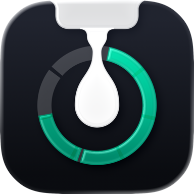
</picture>

# Codometer

Codometer следит за лимитами **Claude Code** и **Codex** и за агентами, которые на вас работают, и держит их в
поле зрения — у края экрана, в плавающей карточке, в строке меню или виджетом на рабочем столе.

Это нативное приложение для macOS. Всё, что оно показывает, читается из файлов, которые обе программы и так пишут
на вашем Mac. Ничего никуда не отправляется, аккаунты не переключаются сами, лимиты не обходятся.

[English version](README.md) · [Приватность](PRIVACY.ru.md) · [Безопасность](SECURITY.md) ·
[История изменений](CHANGELOG.md)

---

## Что вы получаете

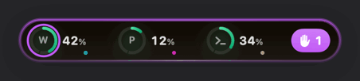

**Остров** — небольшая капсула у любого края экрана с кольцом на каждый лимит. Потянетесь к ней — она раскроется в
карточку: главное окно крупной цифрой с графиком, плитки остальных окон и живые сессии агентов. Цвет кольца
означает только расход; фиолетовый отведён под «агент ждёт вас».

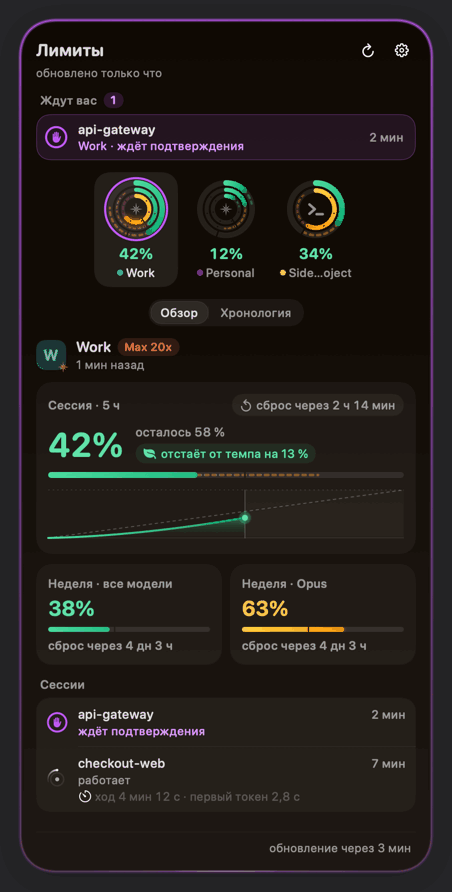

**Плавающая карточка** — второй способ показать то же самое: небольшое окно, которое можно положить куда угодно, в
четырёх оформлениях и трёх размерах; когда не до него, карточка сворачивается в пилюлю. На экране всегда что-то
одно: или остров, или карточка.

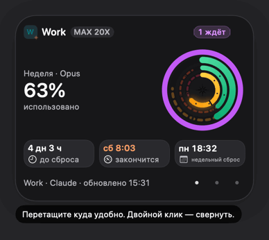

**Строка меню** остаётся при любом выборе: живой значок-кольцо с самым высоким расходом. Клик открывает ту же
карточку во всплывающем окне, правый клик — меню.

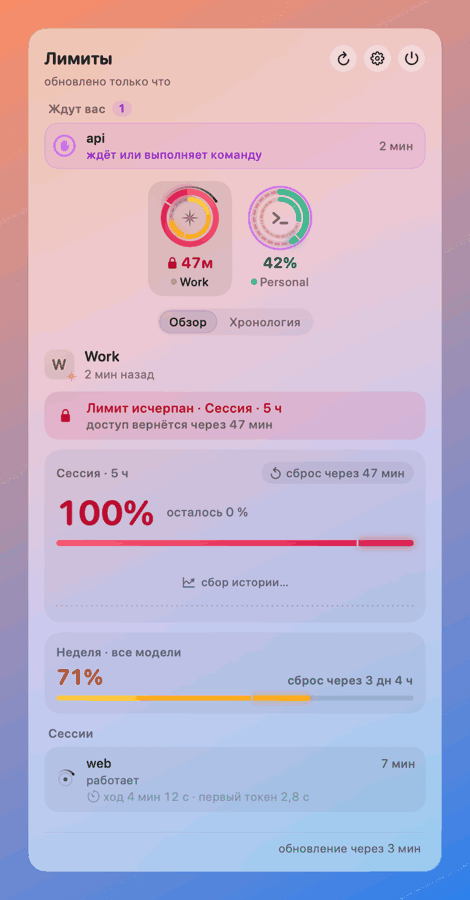

**Виджеты на рабочем столе** — «Лимиты AI» со всеми аккаунтами в трёх размерах и отдельные «Claude» и «Codex» в
двух: кольца расхода, ближайшее окно и отсчёт до сброса.

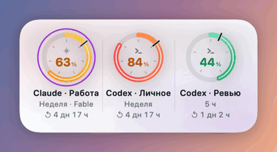

**Аналитика** живёт на второй странице карточки: полосы сессий под кривой расхода главного окна, отметки сбросов и
«Кто съел лимит» — какая доля окна пришлась на каждый проект за 5 часов, сутки или неделю.

**Уведомления** — пороги (80 %, 100 % и любые ваши), сброс лимита, «агент закончил» со временем хода и «агент ждёт
вас». Новое событие заменяет прежнее уведомление о той же сессии или том же окне, а не копится рядом; несколько
событий, пришедших почти одновременно, приходят одним.

Аккаунтов может быть несколько. Claude Code и Codex держат один вход на папку профиля, поэтому каждый аккаунт —
это папка (`CLAUDE_CONFIG_DIR` / `CODEX_HOME`); см. [Второй аккаунт](#второй-аккаунт).

---

## Что нужно

- **macOS 26 (Tahoe) или новее.** Codometer собран под SDK macOS 26 и не использует ничего старее.
- **Apple silicon.** Сборка 1.0.0 — только arm64.
- **Claude Code и/или Codex**, установленные, с выполненным входом. Codometer читает то, что они пишут в
  `~/.claude*` и `~/.codex*`, и запускает их собственные команды (`claude /usage`, `codex app-server`), чтобы
  обновлять лимиты. Без них показывать нечего.
- Для сборки из исходников — **Xcode 26** (см. [Сборка из исходников](#сборка-из-исходников)).

---

## Установка

Codometer не публикуется в Mac App Store. Каждый выпуск — это DMG, приложенный к релизу на GitHub.

1. **Скачайте** `Codometer-1.0.0.dmg` со [страницы релизов](https://github.com/iexbase/Codometer/releases/latest) этого репозитория.
2. **Проверьте загрузку** (необязательно): в том же релизе лежит `SHA256SUMS.txt`.

   ```bash
   cd ~/Downloads && shasum -a 256 -c SHA256SUMS.txt --ignore-missing
   ```

3. **Откройте DMG и перетащите Codometer в «Программы».** Сделайте это до первого запуска. Запущенный с образа
   диска, из «Загрузок» или с тома только для чтения, Codometer покажет предупреждение «Переместите Codometer в
   «Программы»» и закроется, ничего не записав: виджеты, уведомления и «Открывать при входе в систему» работают
   только у установленной копии.
4. **Запустите** его из «Программ» — и будьте готовы, что в первый раз Gatekeeper не пустит: у этой сборки пока нет
   подписи Developer ID.

### Как пройти Gatekeeper у сборки без подписи

1.0.0 подписан локально (ad hoc): без Developer ID и без нотаризации, поэтому macOS не может сказать, кто сделал
эту программу. Всё, что скачано браузером, помечено карантином, и при первом запуске появится «Apple не может
проверить, что программа «Codometer» не содержит вредоносное ПО» с кнопками «Готово» и «Переместить в Корзину» —
без кнопки «Открыть». Правый клик по программе её тоже не даёт: этот обходной путь убрали ещё в macOS 15.

Честный путь, один раз на каждую версию:

1. Дважды щёлкните Codometer в «Программах» и нажмите «Готово» в предупреждении.
2. Откройте **Системные настройки → Конфиденциальность и безопасность** и пролистайте до раздела «Безопасность».
   Сразу после попытки там появится строка «Программа «Codometer» была заблокирована» с кнопкой **«Всё равно
   открыть»**.
3. Нажмите её, подтвердите паролем, затем нажмите **«Открыть»** в следующем окне.

Если вам ближе Терминал, то же самое делает одна команда — она снимает метку карантина:

```bash
xattr -dr com.apple.quarantine /Applications/Codometer.app
```

В обоих случаях вы ручаетесь за загрузку сами, поэтому сверьте контрольную сумму. DMG, скачанный через `curl`,
карантина не получает и ни о чём не спросит — удобно, и именно поэтому сумма важна.

После каждого обновления без подписи это повторится: хеш кода меняется, и macOS спрашивает снова.

**Когда появится Developer ID,** всё это исчезнет. У подписанной и нотаризованной сборки будет обычное «Это
программа, загруженная из интернета. Открыть?» один раз — и она откроется даже без сети, потому что талон
нотаризации прикреплён к самому приложению. Имя DMG не меняется; режим подписи записан в заметках о выпуске и в
`build-info.json` рядом с ним.

### Обновление

Закройте Codometer из строки меню, замените `/Applications/Codometer.app` новой копией и запустите снова.
Настройки, история и расставленные виджеты останутся на месте. Автообновления нет, проверки обновлений тоже:
Codometer никуда не обращается.

---

## Первый запуск

При первом запуске откроется короткое знакомство из шести шагов. Пока вы его не пройдёте или не пропустите,
Codometer ничего не опрашивает.

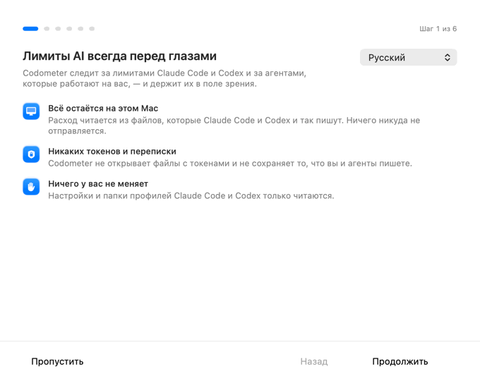

1. **Знакомство** — что делает Codometer и три обещания: всё остаётся на этом Mac, токены и переписка не читаются,
   ваша настройка Claude Code и Codex не меняется.
2. **Найдены на этом Mac** — все профили `~/.claude*` и `~/.codex*`, которые удалось найти, с переключателем у
   каждого. Включите те, за которыми стоит следить.
3. **Где живут ваши лимиты** — остров или плавающая карточка, край экрана и слияние с вырезом камеры.
4. **Второй аккаунт?** — необязательный шаг, о нём ниже.
5. **Уведомления и запуск** — здесь запрашивается разрешение на уведомления (с объяснением, зачем) и включается
   «Открывать при входе в систему».
6. **Всё готово.**

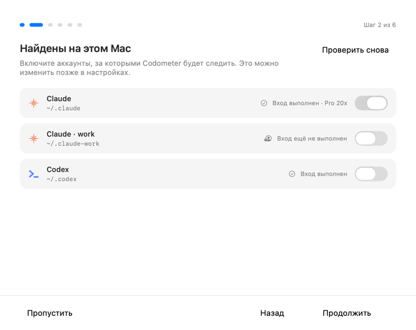

Открыть знакомство ещё раз: **Настройки → Общие → «Открыть знакомство…»**.

### Второй аккаунт

Claude Code и Codex держат один вход на папку профиля, поэтому второму аккаунту нужна своя папка. На четвёртом шаге
знакомства есть мастер, такой же помощник — в разделе «Аккаунты». Вручную это выглядит так:

```bash
# Claude: запустить Claude Code в новой папке профиля, затем ввести в нём /login
CLAUDE_CONFIG_DIR=~/.claude-work claude
```

```bash
# Codex: создать папку и войти
mkdir -p ~/.codex-work && CODEX_HOME=~/.codex-work codex login
```

Запускайте CLI этого аккаунта с той же переменной каждый раз, когда работаете в нём. Новый профиль появится в
**Настройки → Аккаунты → «Найдены на этом Mac»**: включите его и дайте название.

Codometer не выполняет эти команды за вас и ничего не пишет в папки профилей.

---

## Как этим пользоваться

**Остров.** Перетащите его к любому краю — он прилипнет, а с зажатой ⌘ встанет ровно туда, куда вы его ведёте.
Раскрывать можно наведением, кликом или и тем и другим (Настройки → Отображение → «Управление»). Закреплённый
остров закрывается кликом в стороне, кликом по пустому месту заголовка — и клавишей **Esc, даже когда впереди
другое приложение**: пока остров закреплён, а Codometer не активен, работает отдельно зарегистрированный Esc, и
это единственная клавиша, которая до него доходит. Остров, раскрытый наведением, такой Esc не включает, поэтому
нажатие в чужом окне не пропадает зря.

Правый клик по острову открывает меню, двойной — настройки. На MacBook остров умеет расходиться вокруг выреза
камеры и становиться чёрным, чтобы выглядеть его продолжением.


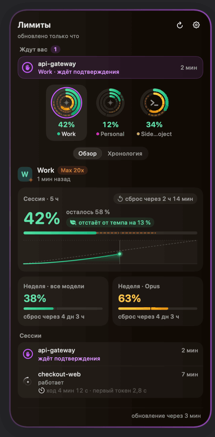

**Сочетание клавиш.** По умолчанию ⌃⌥⌘U (есть ещё ⌃⌥Пробел, ⌃⌥⌘L и «Выкл.») раскрывает и сворачивает текущую
поверхность из любого приложения, а если вас кто-то ждёт — открывает сразу на нём. Оно регистрируется через Carbon,
поэтому не требует доступа к универсальному доступу и не видит других нажатий. Если сочетание уже занято macOS или
другой программой, «Общие» скажут об этом и предложат замену.

**Плавающая карточка.** Перетаскивайте куда удобно; двойной клик сворачивает её в пилюлю, а один клик по пилюле
возвращает обратно. Правый клик даёт оформление (Графит, Liquid Glass, Полночь, Светлая), размер (Компактный,
Обычный, Полоса), выбор аккаунта, режим «Поверх других окон» и экран, на котором карточка живёт. **Полоса** (её можно выбрать и
отдельно: Настройки → Отображение → «Показывать лимиты как») — широкая низкая карточка: слева — сколько осталось от недели, которая ограничивает, справа — по чипу на каждое окно лимита с
расходом и сбросом. Меню «Показывать» задаёт охват: этот аккаунт, все аккаунты Claude, все аккаунты Codex или все
сразу; одинаковые окна нескольких аккаунтов складываются в один чип, который показывает самое заполненное и считает
аккаунты за ним. После клика карточка
принимает клавиатуру: ← и → переключают аккаунты, Esc сворачивает, ⌘, открывает настройки, — а пока вы по ней не
кликнули, Esc остаётся у того окна, в котором вы работаете.

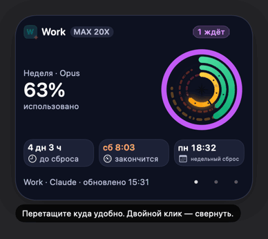
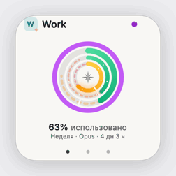
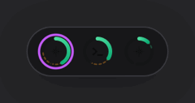

**Виджеты.** Правый клик по свободному месту рабочего стола → **«Изменить виджеты…»** → найдите **Codometer** →
перетащите нужный размер. «Лимиты AI» показывают все аккаунты, «Claude» и «Codex» — самый загруженный аккаунт
своего сервиса. «Лимиты AI · полоса», «Claude · полоса» и «Codex · полоса» — те же три виджета, но всегда в виде
широкой полосы, что бы ни было выбрано в настройке ниже.

Настройки → Общие → **«Вид виджета»** выбирает, как выглядят средний и большой размеры: **«Кольца»** (кольцо на
каждый аккаунт с числом внутри) или **«Полоса»** — недельное окно одной крупной цифрой того, сколько *осталось*, и
компактная плитка на каждое остальное окно с расходом и отсчётом до сброса. На плитке, общей для нескольких
аккаунтов, стоит небольшой счётчик ⊞; что не поместилось, сворачивается в «+N». Маленький размер в любом случае
остаётся кольцом, а виджет переключается в течение минуты.

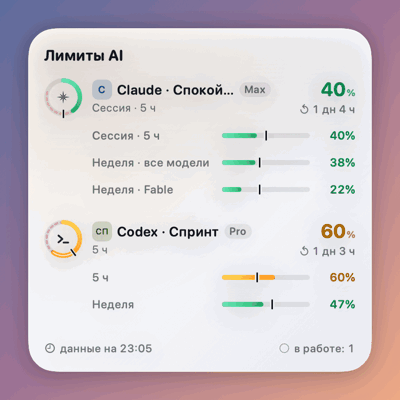

WidgetKit разрешает лишь несколько десятков перерисовок в день, поэтому снимок публикуется экономно: одинаковое
содержимое пропускается, важные изменения (цвет кольца, исчерпанный лимит, устаревшие данные, «ждёт вас», набор
аккаунтов) — не чаще раза в минуту, остальное — не чаще раза в 15 минут, и не больше 12 публикаций в час. **Если
виджет отстаёт от острова на несколько минут — это нормально.** Когда приложение не работает, виджет сам делает
показания серыми через 30 минут после последнего.

---

## Настройки

Шесть разделов. Остров и карточка в настройках — настоящие, с вашими данными, а фон под ними переключается, чтобы
можно было проверить, как читается стекло.

| Раздел | Что внутри |
|---|---|
| **Аккаунты** | Отслеживаемые аккаунты, профили, найденные на этом Mac, группы (до восьми — например «Работа» и «Личное», у каждой свои выключатели уведомлений) и помощник по второму аккаунту. |
| **Отображение** | Остров или плавающая карточка; у острова — край, способ раскрытия, форма (прилегает к краю или парящий), поверхность (Liquid Glass, тёмное стекло, чёрный) и размер; у карточки — оформление, размер, аккаунт и третья плитка; экран для каждой поверхности; примагничивание и отклик трекпада; слияние с вырезом камеры. |
| **Внешний вид** | Окрашивание стекла по расходу; сколько показывать при раскрытии — только главное (все лимиты: расход, остаток и сброс; так по умолчанию) или всё (график, темп, сессии, хронология); что показывать на острове (время сброса отсчётом или часами, недельные лимиты внутренними кольцами, темп и прогноз исчерпания, дуга прогноза, празднование сброса); границы цветов колец («Жёлтый с», «Красный с»); показывать, частично скрывать или скрывать адрес почты — сразу везде. |
| **Уведомления** | Пороги расхода; события (сброс лимита, агент закончил, агент ждёт вас); пропуск коротких ходов; снятие уведомления, когда агент продолжил; объединение почти одновременных событий; звуки и то, раскрывается ли остров сам. |
| **Общие** | Язык, запуск, сочетание клавиш, виджет, энергопотребление, сеть, история и данные, откуда берутся лимиты, приватность, знакомство и «О программе». |
| **Диагностика** | Проверка системы, как идут обновления по каждому аккаунту, программы поставщиков и их подписи, формат данных, хранилище и локальные отчёты о сбоях. |

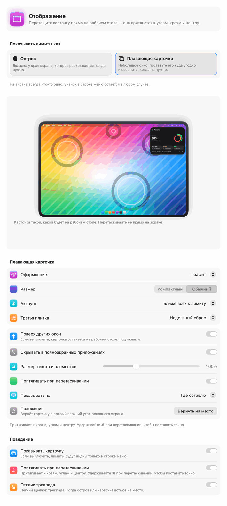
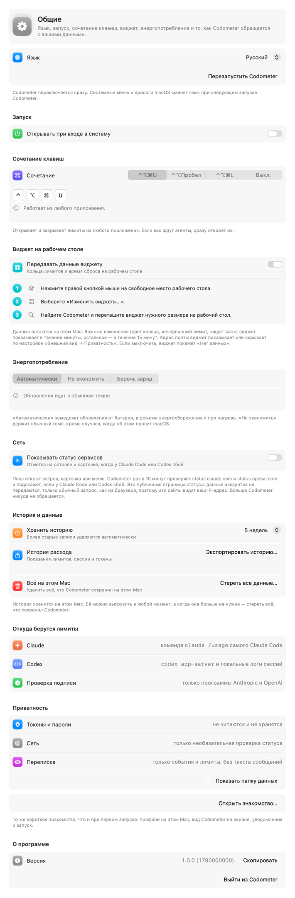

Что именно есть в разделе **«Общие»**:

- **Язык** — English, Русский или «Язык системы». Собственный текст Codometer меняется сразу; системные меню и
  диалоги macOS — при следующем запуске, и рядом есть кнопка «Перезапустить Codometer».
- **Запуск** — «Открывать при входе в систему» и состояние разрешения, о котором сообщает macOS.
- **Сочетание клавиш** — четыре варианта выше и предупреждение, если комбинация занята.
- **Виджет на рабочем столе** — «Передавать данные виджету»; если выключить, файл снимка удаляется. «Вид виджета»: «Кольца» или «Полоса».
- **Энергопотребление** — «Автоматически», «Не экономить» или «Беречь заряд». «Автоматически» замедляет обновления
  от батареи, в режиме энергосбережения и при нагреве, а строка под выбором всегда говорит, что происходит сейчас.
- **Сеть** — «Показывать статус сервисов», **по умолчанию выключено**. Подробнее — в разделе
  [Приватность](#приватность).
- **История и данные** — сколько хранить историю (1 неделя, 2 недели, 5 недель или 3 месяца; по умолчанию
  5 недель), «Экспортировать историю…» и «Стереть все данные…».
- **«Откуда берутся лимиты»** и **«Приватность»** — короткие честные строки, те же самые, что и в этом файле, и
  кнопка «Показать папку данных».
- **Знакомство** — открывает то же знакомство, что и при первом запуске.
- **«О программе»** — версия, номер сборки и строка лицензии.

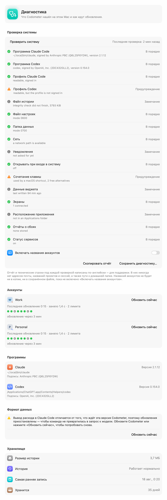

---

## Приватность

Коротко; подробности — в [PRIVACY.ru.md](PRIVACY.ru.md):

- **Токены, пароли, cookie и связка ключей не читаются никогда.** С серверами Anthropic и OpenAI общаются их
  собственные CLI; Codometer смотрит только на то, что эти CLI оставили на диске. У `auth.json` проверяется лишь
  время изменения, сам файл не открывается.
- **Переписка не читается и не хранится.** Из транскриптов Claude декодируются только `requestId`, `message.id`,
  название модели, четыре счётчика `usage` и время. Из логов Codex — только типы событий и числа. Запросы, ответы,
  ввод и вывод инструментов пропускаются, даже не разбираясь.
- **Сети нет вообще**, пока вы не включите **Настройки → Общие → Сеть → «Показывать статус сервисов»**, а это
  **выключено по умолчанию**. Если включить, то раз в 10 минут и только пока видны остров, карточка или всплывающее
  окно, Codometer спрашивает `status.claude.com` и `status.openai.com` — две публичные страницы статуса. Данные
  аккаунтов не передаются; эти сайты видят сам запрос и ваш IP-адрес, как при обычном заходе из браузера.
  Телеметрии, отправки отчётов о сбоях и проверки обновлений нет.
- **Запускаются только подписанные программы поставщиков** — в фиксированной пустой рабочей папке и с чистым
  окружением: `claude` с подписью Anthropic PBC (команда `Q6L2SF6YDW`) и `codex` с подписью OpenAI (`2DC432GLL2`).
  Подложенный в `~/.local/bin` файл исполнен не будет.
- **Codometer ничего не пишет в папки Claude Code и Codex** и не меняет их настройки.
- Адрес почты везде подчиняется одной настройке — «Показывать», «Частично скрывать» (`j•••••e@example.com`) или
  «Скрывать»; в выгрузку он не попадает никогда, в отчёт диагностики тоже, а скрытый не уходит и в виджет.

### Где лежат данные

Всё, что хранит Codometer, лежит в одной папке — `~/Library/Application Support/Codometer` (права `0700`, файлы
`0600`):

| Что | Что внутри |
|---|---|
| `settings.json` | Аккаунты (названия и пути к профилям), группы и все настройки |
| `history.sqlite` (+ `-wal`, `-shm`) | Показания лимитов, отрезки сессий, токены пятиминутными интервалами, запуски сбора |
| `Widget/snapshot.json` | Ровно то, что рисует виджет: названия, окна, счётчики |
| `Diagnostics/` | Отчёты MetricKit о сбоях и зависаниях — только на этом Mac, никуда не отправляются |
| `probe/` | Фиксированная пустая рабочая папка для команд CLI |
| `.lock` | Замок единственного экземпляра |

Ещё две вещи создаёт сама macOS: `~/Library/Containers/com.codometer.Codometer.Widgets/` (песочница расширения
виджета) и домен настроек приложения, где хранятся язык интерфейса и положение окна настроек.

**Выгрузка.** Настройки → Общие → «История и данные» → **«Экспортировать историю…»** сохраняет один файл JSON или
папку с CSV (`limits.csv`, `sessions.csv`, `tokens.csv`, `collection-runs.csv` и `README.txt` с пояснениями). Время
— по ISO 8601, десятичный разделитель — точка, названия столбцов английские. Адресов почты, названий сессий и
запросов в выгрузке не бывает.

**Стирание.** Настройки → Общие → «История и данные» → **«Стереть все данные…»** — лист из двух шагов, который
прямо перечисляет, что удалится, а что останется, и предлагает сначала выгрузить историю. Удаляются история и
таймлайн, настройки, аккаунты и группы, данные виджетов, показанные уведомления и объект входа. Остаются папки
профилей Claude Code и Codex, всё, что вы уже выгрузили, и сам Codometer. Дальше он либо закрывается, либо
начинает заново, как при первом запуске, — на ваш выбор. Отменить это нельзя.

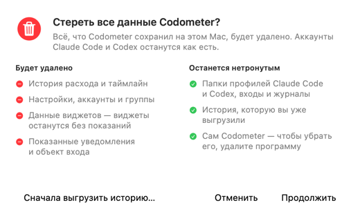

---

## Удаление

1. **Настройки → Общие → «Запуск»**: выключите «Открывать при входе в систему» (или снимите объект входа в
   Системных настройках → «Основные» → «Объекты входа и расширения»).
2. Уберите виджеты: правый клик по рабочему столу → **«Изменить виджеты…»**, затем удалите виджеты Codometer.
3. Необязательно, но аккуратно: **Настройки → Общие → «История и данные» → «Стереть все данные…»** и «Стереть и
   закрыть».
4. Закройте Codometer из строки меню и перетащите `/Applications/Codometer.app` в Корзину.
5. Остатки, если третий шаг вы пропустили:

   ```bash
   rm -rf ~/Library/Application\ Support/Codometer
   rm -rf ~/Library/Containers/com.codometer.Codometer.Widgets
   defaults delete com.codometer.Codometer
   ```

6. Claude Code создаёт пустую папку под рабочий каталог, который Codometer передаёт своим командам. Папку
   `…-Codometer-probe` в `~/.claude*/projects/` можно спокойно удалить.
7. Если вы пользовались приложением под прежним названием, уберите заодно его объект входа в Системных настройках
   и его виджеты с рабочего стола.

---

## Если что-то не так

**Виджет пустой или застрял на заготовке.**
Запустите Codometer хотя бы раз из `/Applications` — расширение виджета регистрируется именно при первом запуске.
Проверьте, что в «Общих» включено **«Передавать данные виджету»**. Дальше:

```bash
# зарегистрировано ли расширение и какая копия
pluginkit -m -v -i com.codometer.Codometer.Widgets

# что сообщает сам виджет: по строке на запрос, только счётчики
log stream --predicate 'subsystem == "com.codometer.widgets"' --level info
```

В строке видно, был ли снимок прочитан (`loaded`, `missing`, `denied` или `invalid`), сколько в нём аккаунтов и
какого он возраста — без имён, адресов и процентов. Если копий Codometer несколько (старая папка сборки,
смонтированный DMG, копия в «Загрузках»), они спорят за один идентификатор виджета: оставьте одну в «Программах»,
остальные удалите, а если галерея всё равно выглядит устаревшей — выйдите из системы и войдите снова.

**Ничего не обновляется или один аккаунт молчит.**
Откройте **Настройки → Диагностика**: у каждого аккаунта видно время последнего обновления, сколько оно заняло,
сколько лимитов вернулось и почему обновление пропущено («нет сети», «ждёт входа», «логи уже свежие», «пауза из-за
смены формата»). Кнопка **«Проверить систему»** проверяет программы, профили, файлы и права, а **«Скопировать
отчёт»** даёт очищенный текст по-английски для обращения в поддержку — без адресов почты, названий проектов и
сессий и без пути к домашней папке.

**«Формат данных» сообщает, что обновления приостановлены.**
Вывод расхода в Claude Code изменился. Codometer останавливает опрос намеренно, чтобы `claude /usage` не
превратился в запрос к модели: нажмите «Обновить сейчас» или обновите Codometer.

**Сочетание клавиш не работает.**
«Общие» назовут, кто занял комбинацию, и предложат другую. ⌃⌥Пробел в macOS часто переключает раскладку.

**Острова нигде нет.**
Настройки → Отображение → «Поведение» → **«Показывать остров»**, а рядом проверьте выбор экрана. Даже со скрытым
островом всё видно в строке меню.

**Codometer закрылся с сообщением «Переместите Codometer в «Программы»».**
Он был запущен с образа диска, из временной копии или с тома только для чтения. Перетащите его в «Программы» и
запустите оттуда. Ничего не сохранено.

**Остальное.** Приложение пишет в системный журнал, без личных данных:

```bash
log stream --predicate 'subsystem == "com.codometer.app"' --level info
log show  --predicate 'subsystem == "com.codometer.app"' --last 1h
```

Категории — `engine`, `claude`, `codex`, `storage` и `interface`.

---

## Сборка из исходников

```bash
Scripts/test.sh                  # весь набор тестов
Scripts/build-app.sh debug       # собирает build/Codometer.app
Scripts/build-app.sh release     # release-конфигурация, подпись ad hoc
Scripts/dev-register.sh build/Codometer.app   # сделать эту копию известной macOS (для виджетов)
```

Скрипты сами выбирают инструменты (`DEVELOPER_DIR=/Applications/Xcode.app/Contents/Developer`), поэтому глобально
переключать Xcode не нужно. Сторонних зависимостей нет: `Package.swift` собирает одиннадцать модулей в языковом
режиме Swift 6 с предупреждениями как ошибками.

`Scripts/release.sh` прогоняет весь релизный конвейер — линты, тесты, оба release-продукта, сборку пакета,
подпись, нотаризацию (если есть доступы), DMG и его проверку — и складывает результат в `dist/<версия>/`.

Дальше для тех, кто правит код:

- [docs/DEVELOPMENT.md](docs/DEVELOPMENT.md) — рабочий цикл, сценарии для debug-сборки, снимки интерфейса,
  изолированные папки данных и правила регистрации.
- [docs/ARCHITECTURE.md](docs/ARCHITECTURE.md) — модули, поток данных, расписание опроса, хранилище, виджет.
- [docs/LOCALIZATION.md](docs/LOCALIZATION.md) — как пишется и проверяется текст на двух языках.
- [docs/RELEASING.md](docs/RELEASING.md) — версии, CI, подпись, нотаризация, черновик релиза.

---

## Частые вопросы

**Из-за Codometer лимиты закончатся быстрее?** Нет. Он читает то, что CLI и так записывают, и вызывает
`claude /usage` — команду, которую Claude Code для этого и предоставляет. Аккаунты не переключаются, запросы не
повторяются, лимиты не обходятся.

**`claude /usage` тратит токены?** Это собственная команда Claude Code о расходе, а не запрос к модели. Если её
вывод перестаёт быть похожим на отчёт о расходе, Codometer приостанавливает такие обновления, а не рискует.

**Почему виджет показывает более старые числа, чем остров?** Так задумано — см. бюджет публикаций выше.

**Можно пользоваться без Claude Code?** Да, только с Codex — или наоборот. Без обоих отслеживать нечего.

**А на Intel?** В 1.0.0 — нет, сборка только для Apple silicon.

**Где английские снимки экрана?** Те же изображения лежат в `docs/images/en/`, а у этого файла есть
[английская версия](README.md).

---

## Статус и лицензия

Codometer 1.0.0 — первый публичный выпуск. Известные ограничения перечислены в [CHANGELOG.md](CHANGELOG.md) и в
[заметках о выпуске](docs/release-notes/1.0.0.ru.md).

**Лицензия пока не выбрана**, поэтому файла `LICENSE` в репозитории нет. До тех пор действует обычное авторское
право: исходный код можно читать и собирать для себя, никаких других прав он не даёт. Если нужно больше — сначала
спросите.

О проблемах с безопасностью — [SECURITY.md](SECURITY.md).

---

## Товарные знаки

Codometer — независимый проект. Он не связан с Anthropic, OpenAI и Apple, не одобрен и не спонсируется ими. Claude
и Claude Code — товарные знаки Anthropic PBC; Codex, ChatGPT и OpenAI — товарные знаки OpenAI; Apple, Mac, macOS и
Liquid Glass — товарные знаки Apple Inc. Здесь они названы только для того, чтобы сказать, с чем работает
Codometer.
